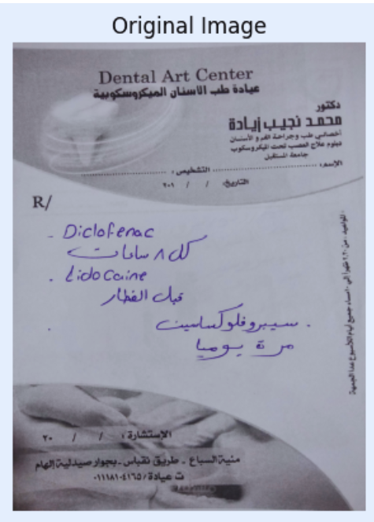
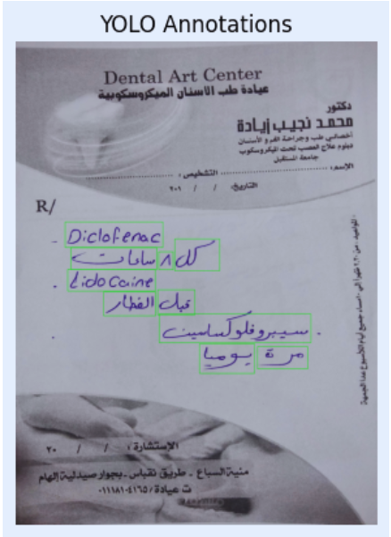
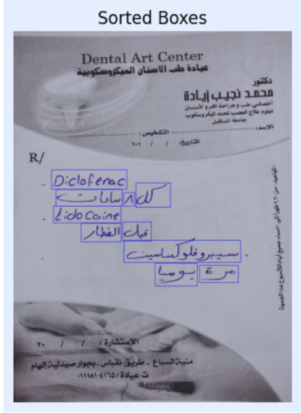
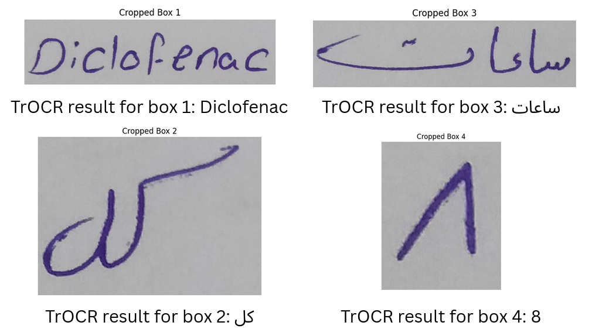
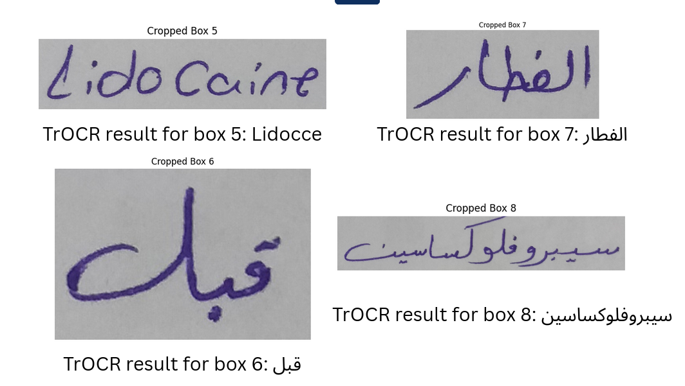
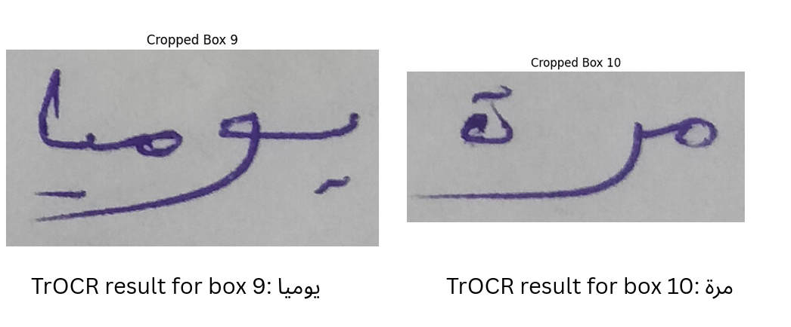
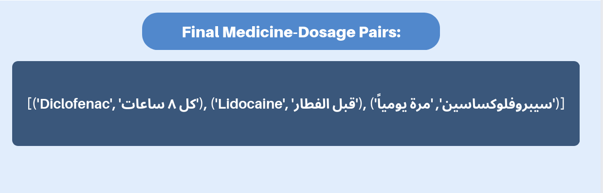

#  **Tour Behind the Scene: Handwritten Prescription Understanding**

This project presents an end-to-end pipeline for extracting structured data from handwritten medical prescriptions in Arabic and English using advanced deep learning models.

---

## 1️⃣ **Original Prescription Image**



---

## 2️⃣ **YOLO Word-Level Detection**



🧹 **After Removing Duplicates:**
**Detected Word Boxes:** 10


---

## 3️⃣ **Word Cropping & Handwriting Recognition (TrOCR)**

Cropped word images are passed to a fine-tuned TrOCR model for word-level handwriting recognition.





---

## 4️⃣ **Full Extracted Text (Raw OCR Output)**

```plaintext
Diclofenac كل ساعات 8 Lidocce قبل الفطار سيبروفلوكساسين يوميا مرة
```

---

## 5️⃣ **Reordered & Structured Text (BART Model)**

Using a BART-based model to reorder and structure the raw OCR output:

```plaintext
Diclofenac كل ٨ ساعات , Lidocaine قبل الفطار , سيبروفلوكساسين مرة يومياً
```

---

## 6️⃣ **Extracted Medicine Names**

```plaintext
Diclofenac , Lidocaine , سيبروفلوكساسين
```

---

## 7️⃣ **Extracted Dosage Instructions**

```plaintext
كل ٨ ساعات , قبل الفطار , مرة يومياً
```

---

## 8️⃣ **Final Structured Output**

The final result: structured **medicine–dosage pairs**, ready for downstream medical applications.



---


