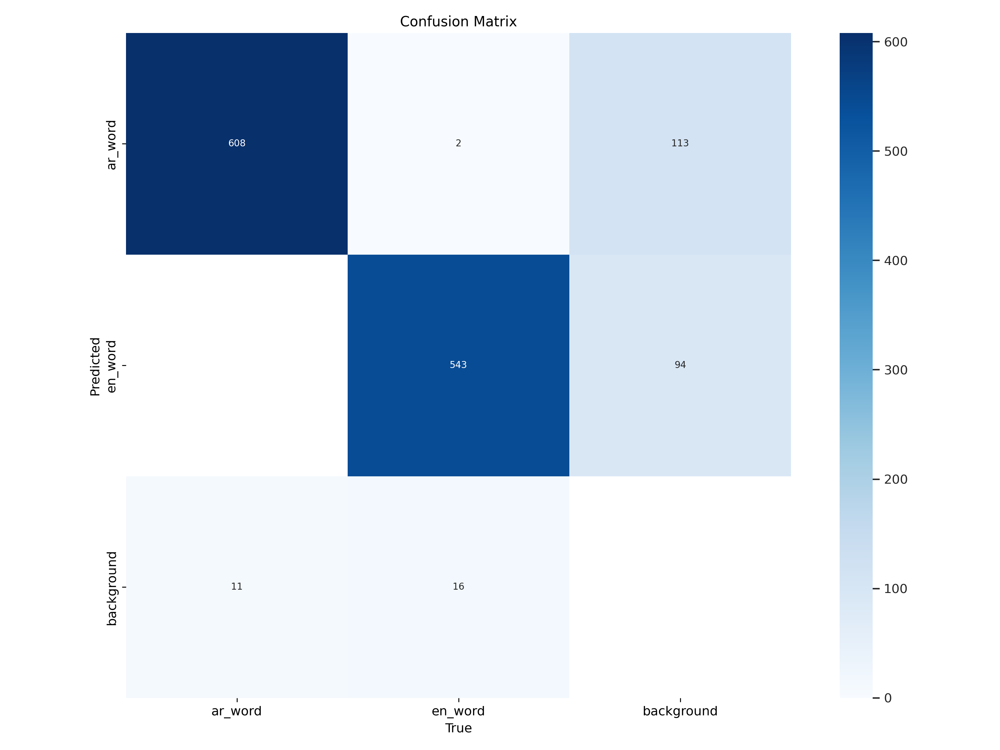
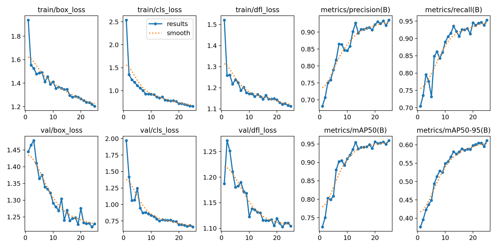

# **Word Detection with YOLOv8** 

This project focuses on training a YOLOv8 object detection model to accurately detect and classify Arabic (`ar_word`) and English (`en_word`) words in images using custom-labeled data.

---

## **Project Link**

- 📦 **Roboflow Dataset**: [View Dataset on Roboflow](https://universe.roboflow.com/handwritten-annotation/word-annotation)

---

## **Dataset**

The dataset contains three sets:
- **Training images** (`train/images`) and annotations (`train/labels`)
- **Validation images** (`valid/images`) and annotations (`valid/labels`)
- **Test images** (`test/images`) for final prediction

The dataset was configured using a `data.yaml` file that includes the class names and paths.


The dataset consists of annotated images for object detection of three classes: `ar_word`, `en_word`, and `background`.

**Dataset Split:**

| Split      | Percentage | Number of Images |
|------------|------------|------------------|
| Train Set  | 73%        | 495              |
| Valid Set  | 18%        | 120              |
| Test Set   | 9%         | 61               |


---

## ⚙️ Training

```bash
!yolo task=detect mode=train model=yolov8s.pt data={dataset.location}/data.yaml epochs=25 imgsz=800 plots=True
```

- Model: YOLOv8s (small version)
- Epochs: 25
- Image size: 800x800
- Plots: Enabled (loss, precision, recall, etc.)

### Sample Result for `en_word` class:
```
Precision: 0.929
Recall:    0.957
mAP50:     0.949
mAP50-95:  0.608
```

##  **Validation Results**

```bash
!yolo task=detect mode=val model=/content/runs/detect/train/weights/best.pt data={dataset.location}/data.yaml
```


### Overall Validation Metrics:
| Class      | Precision | Recall | mAP50 | mAP50-95 |
|------------|-----------|--------|-------|-----------|
| **ar_word**| 0.944     | 0.947  | 0.970 | 0.615     |
| **en_word**| 0.929     | 0.957  | 0.949 | 0.611     |
| **All**    | 0.936     | 0.952  | 0.960 | 0.613     |

## 📊 Confusion Matrix



- `ar_word` was correctly predicted 608 times, misclassified 113 times as background.
- `en_word` was correctly predicted 543 times, misclassified 94 times as background.
- Only minor confusion between `ar_word` and `en_word`.

## 📉 Training & Validation Curves



Key observations from the plots:
- **Loss curves** (box, cls, dfl) show smooth convergence.
- **Precision and Recall** improved steadily throughout training.
- **mAP50 and mAP50-95** increased consistently, reaching:
  - mAP50: ~0.96
  - mAP50-95: ~0.61

## **Summary**

- The model achieves high accuracy in detecting both Arabic and English words in images.
- Very good generalization as seen from validation metrics.
- Suitable for applications such as **OCR pre-processing**.

---
