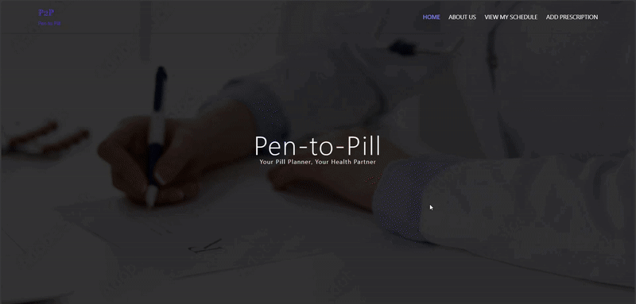

# 🩺 Pen to Pill (P2P) - Prescription Digitization System

> 🎓 **Summit Machathon 6.0 Project**  
> 👥 **Team Members:** Habiba Yousri, Haneen Akram, Renad Hossam, Mohammed Mostafa, Shrouk Mohamed

---
## 🎥 Demo



---

## 📖 Overview

**Pen to Pill (P2P)** is an AI-powered system that digitizes handwritten medical prescriptions, focusing on complex **multilingual documents** (Arabic & English).  
It aims to **enhance patient safety** and **boost healthcare efficiency** by converting unstructured handwriting into structured, usable medical data.

---

## 🛠️ Tools & Technologies

| Technology     | Purpose                                  |
|----------------|-------------------------------------------|
| **Roboflow**      | Annotation tool for labeling Arabic & English text |
| **YOLOv8**         | Detects handwritten regions in prescriptions        |
| **TrOCR**          | Multilingual OCR for handwritten text               |
| **BART (mBART)**   | Structures and cleans the recognized text           |
| **Python**, **PyTorch** | Core implementation frameworks                |
| **Google Colab / Kaggle** | Model training & experimentation         |
| **React.js**       | Frontend UI                                      |
| **FastAPI**         | Backend API development                          |

---

## 🧪 Methodology

A step-by-step AI pipeline:

1. **Handwritten Word Detection**
   - Annotate data using Roboflow
   - Train YOLOv8 on multilingual bounding boxes

2. **Duplicate Removal**
   - Use Non-Maximum Suppression (IoU = 0.8)

3. **Box Sorting**
   - Top-to-bottom, left-to-right for logical reading order

4. **Text Recognition (TrOCR)**
   - Process word crops and predict text with fine-tuned TrOCR

5. **Text Reconstruction**
   - Combine detected words into one coherent string

6. **Text Correction & Structuring (mBART)**
   - Normalize output to this format:  
     `medicine dosage, medicine dosage, ...`

7. **Post-Processing**
   - Extract structured `(medicine, dosage)` pairs

---

## 🚀 Future Work

- Add more real-world handwritten prescriptions to the dataset
- Enhance mBART accuracy for edge cases
- Integrate with EHR systems and mobile apps
- Support more languages beyond Arabic-English

---

## ⚙️ Installation & Deployment

### 🔧 Prerequisites

- [Node.js](https://nodejs.org/) & npm
- Python 3.10.0
- Git

---

### 💻 Frontend Setup

```bash
cd FrontEnd
npm i
npm run server
````

➡️ In a new terminal:

```bash
npm start
```

---

### 🖥️ Backend Setup

```bash
cd ..
cd BackEnd
```
Make sure the Python version is 3.10.0
* **Windows:**
  
   ```bash
    python --version
   ```
   
* **Linux/macOS:**
  
   ```bash
    python3 --version
   ```

#### 1. Create a virtual environment:

* **Windows:**

  ```bash
  python -m venv venv
  ```
* **Linux/macOS:**

  ```bash
  python3 -m venv venv
  ```

#### 2. Activate the environment:

* **Windows:**

  ```bash
  venv\Scripts\activate
  ```
* **Linux/macOS:**

  ```bash
  source venv/bin/activate
  ```

#### 3. Install dependencies:

```bash
pip install -r requirements.txt
```

#### 4. Run the backend:

* **Windows:**

  ```bash
  python app.py
  ```
* **Linux/macOS:**

  ```bash
  python3 app.py
  ```

---

🌐 The frontend runs at `http://localhost:8000` and communicates with the backend via FastAPI.