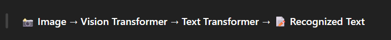
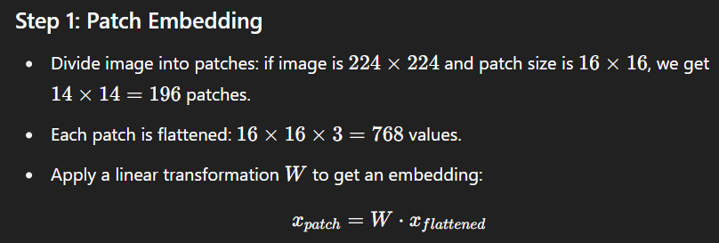
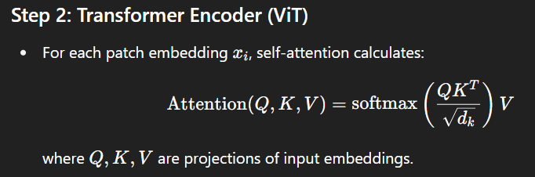
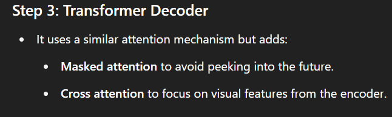
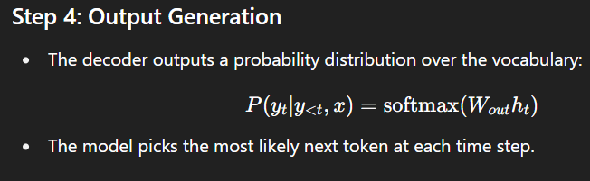
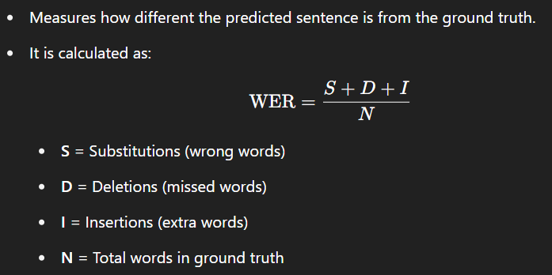
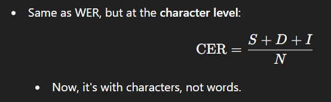
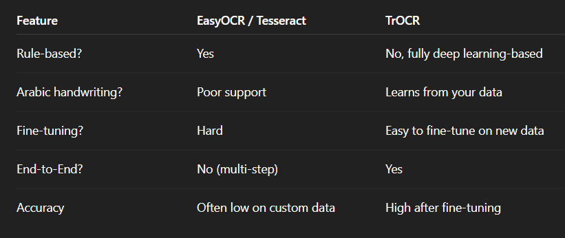

# _Text Extraction Challenge_

## Required

OCR experiments: EasyOCR, Tesseract, and final fine-tuned TrOCR.
talk about the result of the model and know the metrics and what does it represent, and the split size of data, rehearse the poster

---

## Talk Preparation

### OCR model

- first thing, we searched on how to make text extraction form images, we found that OCR models are the best fit to make this task, there were many OCR models, we tried easyocr model and Tesseract, but they didn't perform well on Arabic handwritten, they often misread characters, missed words, or struggled with alignment and noise.

### TrOCR model

- that led us to TrOCR model, it was the best of them when we tried it, but it wasn't the best thing, so we decided we need to fine tune it.

### making new dataset to fine tune

- we make a dataset contains of the cropped images from YOLO and the word in the cropped image, and began to fine tune TrOCR on this data and make image

### image processing

- processing to the cropped images before giving it to the model, the preprocessing is Grayscale conversion, contrast enhancement, resize to a fixed height of 64 pixels with maintaining aspect ration, then convert the image back to RGB to match TrOCR input format

### model evaluation and testing

- to evaluat the model we used two metrices which are WER and CER and the loss was dropping with good rate without making overfitting
  and to test the model we used exact match accuracy with 80% and character-level accuracy with 84%

---

## what is TrOCR ?

TrOCR -> Transformer-based OCR (Optical Character Recognition) using Vision Transformer (Vit) as an image encoder and a Text Transformer as a decoder

## TrOCR Architecture

_1- `Encoder`: Vision Transformer (Vit)_

- the encoder processes the image
- the image is divided into small patches (16 \* 16 pixels)
- these patches are flattened into vectors and linearly projected into embeddings (use weights to multiply with the vector to turn it into an embedding vector of fixed size).
- a position embedding is added (so mode know the patch positions).
- the resulting sequency of embeddings goes through multiple _self-attention layers_ (Transformer blocks).

### why it works ?

instead of extracting hand-crafted features (edges, contours), the ViT learn meaningful visual representation directly from the image

_2- `Decoder` : Text Transformer_

- this part takes the encoder's output and generates text token-by-token.
- the decoder has:
  - masked self-attention: it only sees previously generated tokens.
  - cross-attention: it predicts the next character or word in the sequence.
- at each time step, it predicts the next character or word in the sequence.

## Math behind TrOCR

## Evaluation Metrics

_1- Word Error Rate (WER)_

_2- Character Error Rate (CER)_

_3- Exact Match Accuracy_

- The percentage of predictions that exactly match the ground truth at the word level.
- If 100 predicted words and 76 are exact matches: 76% Exact Match Accuracy

_4- Character-Level Accuracy_

- Measures what percentage of individual characters are correct.
- If a word has 7 characters and 6 are correct, that’s ~85.7% accuracy for that word.

## ✅ Why TrOCR is Better than EasyOCR or Tesseract

