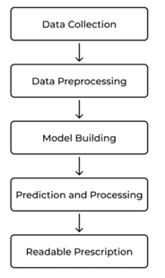
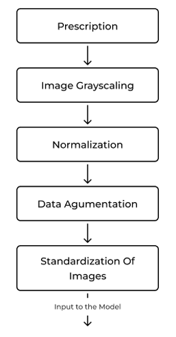
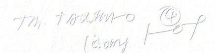
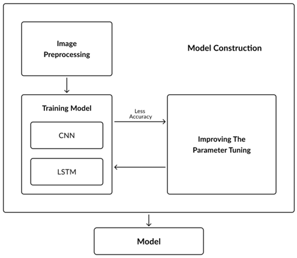
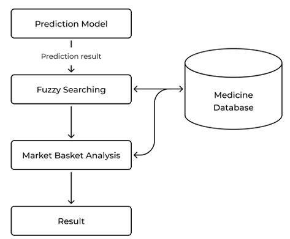

CNN, RNN, LSTM -> image recognition
OCR -> word segmentation in image processing
## Papers approaches

####  1. Recognition of Doctors’ Cursive Handwritten Medical Words by using **Bidirectional LSTM** and **SRP** Data Augmentation.(2021)
-  **SRP** -> is used to increase the number of data samples.
- **Bidirectional LSTM** -> is applied to the sequential line data derived from the augmented handwritten images to produce complete end-to-end recognition.
- The model achieved 73.4% accuracy without data expansion and 89.5% accuracy with **SRP** data expansion

####  2. Handwriting Recognition for Medical Prescriptions using a CNN-Bi-LSTM Model(2021)
-  neural network techniques such as **CNN and BI-LSTM** for predicting doctor’s handwriting from medical prescriptions.
-  **CTC loss** function is used for normalization. 
-  Image acquisition and data augmentation are used for image preprocessing

####  3. Medical Handwritten Prescription Recognition Using CRNN.(2019)
-  **Convolutional Recurrent Neural Network (CRNN)**
    - translate  handwritten English into digital text.

####  4. Intelligent Tool For Malayalam Cursive Handwritten Character Recognition Using Artificial Neural Network And Hidden Markov Model. (2017)
- **Hidden Markov Model (HMM)**
-  By employing a **median filter**, the algorithm used here helps to avoid errors caused by **noise** in the scanned image.
- **Artificial Neural Network (ANN)** aids in the acquisition
-  better results in terms of speed and
 accuracy. As a result, the combination of both English and
 Malayalam characters 

### Design phase 

#### A. Data pre-processing and training model:
- Data  Preprocessing:
 

1. **Grayscale conversion**
 - The photos in grayscale are then prepared for the word segmentation procedure.
 - Utilizing blank spaces and other special characters, the prescription's words are divided into segments. After segmentation, the words are normalised

2. **Normalization**
 -  values range from **0 to 255**. We divide the value of the gray scaled pixel by 255 in order to conduct **normalization**, which is the conversion of the pixel range from **0 to 1**

3. **edge detection**
 -  identify the significant properties such as **discontinuities** in the photometrical, geometrical, and physical attributes 
 

4. **Data Augmentation:**
 - procedure frequently includes rotation, cropping, shearing, horizontal and vertical flipping
 - by doing so, we can keep the neural network from learning from irrelevant data.

5. **Image standardization:**
 - convert the height and weight of a picture to a common scale

6. **Training the model:**
 - train the model using 50 ecop

####  B. Model Building and Prediction:

- **CNN**, **RNN**, and **LSTM** neural networks are used to train 
- The Python libraries **TensorFlow** and **Keras** are used for coding.
- the model has two **CNN** layers and two **RNN** layers. 32 and 64 filters are used for the two levels of CNN, respectively. 
- **RNN** has two layers, each with 64 and 128 filters.
- The **SoftMax** activation function
- Connectionist Temporal Classification **(CTC) Loss** is used to compute the loss function
- utilize **market basket analysis** **fuzzy search** to offer further assistance to the model.
- **Fuzzy search:**
 -  It is used to deliver the precise predicted tablet word even if the model recognised only a few words in it, whereas
 - provide the name even if the spelling is incorrect. 
- **Market basket analysis:**
 - fetch the name faster based on use.

####  C. Unicode Data:
- **OCR** is the finest method for character recognition
- post-processing step to the **OCR** to achieve valid character recognition. In this method, typical characters that have already been divided into meaningful parts and used to train the model with unicodes are combined to form a string using mapper.
- The result will then be classified as **valid UAM** (unicode Approximation Model) or **invalid UAM.**
- invalid UAM is processed again with a string pattern matching algorithm and cross-checked

### Results and test cases
- To get a favorable result, we trained the model with **50 ecop**
- we divided the data into **90% for training and 10% for testing and validating** the model.
- **CTC** loss function was kept as low as possible

---

#### **Key Technologies and Methods Used**
- **Deep Learning Models:** CNN (Convolutional Neural Network), RNN (Recurrent Neural Network), and LSTM (Long Short-Term Memory) are employed to recognize and process handwritten text.
- **Optical Character Recognition (OCR):** Used to extract text from images.
- **Preprocessing Techniques:**
  - **Grayscale conversion:** Converts images to black, white, and gray for better processing.
  - **Edge detection:** Identifies key features in handwriting.
  - **Normalization & Standardization:** Ensures uniform data representation.
  - **Data Augmentation:** Improves recognition accuracy by generating variations of training data.
- **Unicode Processing:** Handles multi-language support by encoding characters appropriately.
- **Prediction Optimization Techniques:**
  - **Fuzzy Search:** Improves recognition accuracy even when parts of the word are unclear.
  - **Market Basket Analysis:** Speeds up the recognition process by identifying frequently used medicines.

#### **Application Workflow**
1. **Image Upload:** User uploads a scanned or photographed prescription.
2. **Preprocessing:** Image is cleaned and segmented into words.
3. **Deep Learning Model Training:** CNN, RNN, and LSTM models process the text.
4. **Text Recognition & Validation:** OCR and fuzzy search optimize the results.
5. **Output Generation:** The application provides a structured, easy-to-understand text format.

#### **Future Improvements**
- Increase training data to improve accuracy.
- Reduce processing time for faster recognition.
- Expand platform compatibility for wider usage.
